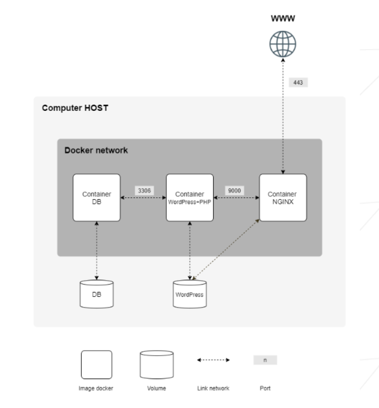

# Inception

## Skills

- **System Administration**
  - Configuration and management of virtual machines.

- **Docker**
  - Creation and management of custom Docker images.
  - Writing Dockerfiles.
  - Using `docker-compose`.
  - Managing Docker networks and volumes.

- **Security**
  - Implementing secure connections (TLSv1.2/1.3).
  - Using environment variables and Docker secrets.

- **Automation**
  - Writing Makefiles to automate deployment.

- **Web Services**
  - Deploying and configuring NGINX, WordPress, and MariaDB.
  - Managing users and permissions in WordPress.


## Project Overview 

Ce projet réalisé à l'école 42 m'a permis d'acquérir des connaissances en administration système à travers l'utilisation de Docker et Docker Compose. En créant mes propres images via la rédaction de Dockerfiles, j'ai été amenée à configurer des conteneurs pour divers services tels que NGINX, WordPress et MariaDB. L'objectif principal était de déployer un site WordPress complet dans un environnement isolé et modulaire.

Chaque service fonctionne dans un conteneur dédié, avec NGINX assurant la gestion sécurisée du trafic HTTP et HTTPS en tant que point d'entrée. WordPress utilise MariaDB pour stocker ses données, nécessitant une configuration minutieuse pour garantir une communication fluide et sécurisée entre les conteneurs. Le projet a été un défi technique enrichissant, incluant la création de Dockerfiles personnalisés pour chaque service, l'utilisation de docker-compose pour l'orchestration, la gestion de volumes pour assurer la persistance des données, la création et sécurisation de la base de données SQL, et la mise en œuvre de bonnes pratiques de sécurité.

L'utilisation de Docker Compose permet de créer un environnement reproductible, assurant que l'application fonctionne de manière cohérente sur n'importe quel OS compatible Docker. Cela simplifie les déploiements et élimine les risques liés aux différences de configuration entre les environnements de développement, de test et de production.



## Content 

L'arborescence choisie a été rganisée pour structurer efficacement les composants du projet Docker, facilitant ainsi la gestion, le déploiement et la maintenance des services Nginx, WordPress et MariaDB. Chaque dossier de service contient un Dockerfile pour définir l'image Docker, un dossier conf pour les fichiers de configuration spécifiques, et un dossier tools pour les scripts utilitaires nécessaires à l'initialisation et à la gestion du service.
.
├── Makefile
└── srcs
    ├── docker-compose.yml
    └── requirements
        ├── mariadb
        │   ├── Dockerfile
        │   ├── conf
        │   │   └── server.cnf
        │   └── tools
        │       └── create_db.sh
        ├── nginx
        │   ├── Dockerfile
        │   ├── conf
        │   │   └── nginx_config
        │   └── tools
        │       ├── efinicke.42.fr.crt
        │       └── efinicke.42.fr.key
        ├── tools
        │   └── make_dir.sh
        └── wordpress
            ├── Dockerfile
            ├── conf
            │   └── php.conf
            └── tools
                └── wp-config-install.sh


- **Nginx** : Nginx est utilisé comme serveur web et proxy pour servir le contenu de WordPress et gérer les demandes HTTP/HTTPS. Pour info, environ 33% à 35% des sites webs dans le monde l'utilisent, notamment des entreprises majeures comme Netflix et GitHub. La raison est que Nginx utilise un modèle d'événement asynchrone et non-bloquant, ce qui lui permet de gérer des milliers de connexions simultanées avec une faible consommation de ressources, ce qui est idéale pour les plateformes à fort trafic.
- **WordPress** : WordPress est un système de gestion de contenu (CMS) open source populaire, utilisé pour créer des sites web, des blogs et des applications en ligne grâce à une interface utilisateur intuitive conviviale pour la création de contenus. Je l'ai déployé comme conteneur pour fournir une plateforme de gestion de contenu dynamique.
- **MariaDB** : MariaDB est un système de gestion de base de données relationnelle open source, dérivé de MySQL. Il est conçu pour offrir une compatibilité avec MySQL tout en améliorant les performances et la sécurité. Je l'utilise comme base de données backend pour stocker les données de WordPress, telles que les articles, les utilisateurs et les paramètres du site.


#### Configuration files

- **`server.cnf` (MariaDB)** :
  - Ce fichier est un fichier de configuration standard pour MariaDB, dérivé de MySQL.
  - **Rôle** : Il est utilisé pour configurer divers aspects du serveur de base de données MariaDB, comme les paramètres de performance, les chemins des fichiers de données, les limites de connexion, etc. Le format et la structure sont basés sur les conventions standards de MariaDB/MySQL.

- **`create_db.sh` (MariaDB)** :
  - Script de démarrage personnalisé pour initialiser la base de données MariaDB.
  - **Rôle** : Ce script est utilisé pour vérifier si la base de données est initialisée, créer les utilisateurs et les bases de données nécessaires, puis démarrer MariaDB. Il est exécuté lors du démarrage du conteneur MariaDB.

- **`nginx_config` (Nginx)** :
  - Ce fichier est une configuration personnalisée pour Nginx.
  - **Rôle** : Il contient les directives spécifiques pour configurer le serveur Nginx, telles que les paramètres de serveur virtuel, les directives de redirection, et les configurations SSL. Le contenu suit les conventions de configuration de Nginx.

- **`php.conf` (WordPress)** :
  - Ce fichier est un fichier de configuration pour PHP, utilisé spécifiquement pour l'environnement WordPress.
  - **Rôle** : Il configure les paramètres de PHP, tels que les limites de mémoire, le temps d'exécution des scripts, et les options de gestion des erreurs. Le format et le contenu suivent les conventions des fichiers de configuration PHP.

- **`wp-config-install.sh` (WordPress)** :
  - Script de démarrage pour configurer et installer WordPress.
  - **Rôle** : Ce script est utilisé pour générer le fichier de configuration WordPress (`wp-config.php`), installer WordPress avec les paramètres fournis, créer un utilisateur administrateur, et installer un thème. Il est exécuté lors du démarrage du conteneur WordPress.


####  Security
- **HTTPS** : extension du protocole HTTP, utilisant TLS (ou SSL) pour sécuriser la communication entre un navigateur web et un serveur web.
- **Certificats SSL/TLS** : Les certificats SSL/TLS sont utilisés pour sécuriser les communications entre un serveur web et un client en chiffrant les données échangées. Ils garantissent que les informations transmises sont protégées contre les interceptions et les attaques, et permettent de passer du protocole HTTP au protocole HTTPS.
- **mkcert** : c'est cet outil qui m'a permis de créer des certificats SSL/TLS auto-signés locaux qui sont reconnus comme valides par le navigateur. Il simplifie la génération de certificats pour le développement local en évitant les avertissements de sécurité des navigateurs. 


## Etapes pour déployer notre projet :

1. Mettre à jour les référentiels : 
```bash
$ sudo apt update
$ sudo apt upgrade -y
```

2. Installer Docker-Compose  :
https://docs.docker.com/engine/install/ubuntu/

3. Permettre à notre $USER d'utiliser docker-compose sans sudo :
https://docs.docker.com/engine/install/linux-postinstall/

4. Lancer notre docker-compose : 
```bash
make
```
5. Se rendre sur le localhost pour accéder à la page 

## CLI (Command Line Interface)

- **`docker --version`** : Affiche la version de Docker installée.
- **`docker info`** : Affiche les informations système de Docker.

### Containers

- **`docker ps`** : Affiche la liste des conteneurs en cours d'exécution.
- **`docker ps -a`** : Affiche la liste de tous les conteneurs, y compris ceux qui ne sont pas en cours d'exécution.
- **`docker run <options> <image>`** : Crée et exécute un nouveau conteneur à partir d'une image.
- **`docker stop <container_id>`** : Arrête un conteneur en cours d'exécution.
- **`docker start <container_id>`** : Démarre un conteneur arrêté.
- **`docker restart <container_id>`** : Redémarre un conteneur.
- **`docker rm <container_id>`** : Supprime un conteneur.
- **`docker exec -it <container_id> /bin/sh`** : Ouvre une session interactive dans un conteneur.
- **`docker logs <container_id>`** : Affiche les logs d'un conteneur.

### Images

- **`docker images`** : Affiche la liste des images disponibles localement.
- **`docker pull <image>`** : Télécharge une image depuis un registre Docker.
- **`docker build -t <image_name>:<tag> <path>`** : Construit une image Docker à partir d'un Dockerfile.
- **`docker rmi <image_id>`** : Supprime une image.
- **`docker tag <source_image> <target_image>`** : Marque une image avec un nouveau nom ou tag.

### Networks

- **`docker network ls`** : Affiche la liste des réseaux Docker.
- **`docker network inspect <network_name>`** : Affiche les détails d'un réseau spécifique.
- **`docker network create <network_name>`** : Crée un nouveau réseau Docker.
- **`docker network rm <network_name>`** : Supprime un réseau Docker.

### Volumes

- **`docker volume ls`** : Affiche la liste des volumes Docker.
- **`docker volume inspect <volume_name>`** : Affiche les détails d'un volume spécifique.
- **`docker volume create <volume_name>`** : Crée un nouveau volume Docker.
- **`docker volume rm <volume_name>`** : Supprime un volume Docker.
- **`docker volume prune`** : Supprime tous les volumes non utilisés.

### Docker Compose

- **`docker compose up`** : Démarre les services définis dans le fichier `docker-compose.yml`.
- **`docker compose down`** : Arrête et supprime les conteneurs, réseaux et volumes créés par **`docker compose up`**.
- **`docker compose build`** : Reconstruit les images définies dans le fichier `docker-compose.yml`.
- **`docker compose logs`** : Affiche les logs des services définis dans le fichier `docker-compose.yml`.
- **`docker compose ps`** : Affiche les conteneurs associés aux services définis dans le fichier `docker-compose.yml`.

### Database

- **`docker exec -it <mariadb_container_id> mysql -u root -p`** : Connecte à MariaDB en tant qu'utilisateur root dans le conteneur.
- **`SHOW DATABASES;`** : Affiche la liste des bases de données dans MariaDB.
- **`USE <database_name>;`** : Sélectionne une base de données.
- **`SHOW TABLES;`** : Affiche la liste des tables dans la base de données sélectionnée.
- **`SELECT * FROM <table_name>;`** : Affiche le contenu d'une table spécifique.


## Links 

- [42 codeshaman](https://github.com/efinicke/inception/)
- [Entrainement avec images dl sur le hub](https://medium.com/swlh/wordpress-deployment-with-nginx-php-fpm-and-mariadb-using-docker-compose-55f59e5c1a)
- [Docker video course 3hrs](https://www.youtube.com/watch?v=3c-iBn73dDE)
- [tuto : Connecter plusieurs conteneurs](https://www.nicelydev.com/docker/connecter-conteneurs-reseau#h2_0)
- [Using Variables in Docker-Compose](https://betterprogramming.pub/using-variables-in-docker-compose-265a604c2006)
- [The Importance of the .dockerignore File](https://www.codingzeal.com/post/the-importance-of-the-dockerignore-file)
- [Blog d'un devOps](https://blog.stephane-robert.info/docs/)
- [Modifier wp-config.php](https://codex.wordpress.org/fr:Modifier_wp-config.php)
- [Make Wordpress hosting](https://make.wordpress.org/hosting/handbook/server-environment/)
- [Nginx](https://www.nicelydev.com/nginx)
- [Install ufw](https://linuxhint.com/advanced-ufw-firewall-configuration-ubuntu-22-04/)
- [42 llescure](https://github.com/llescure/42_Inception)
